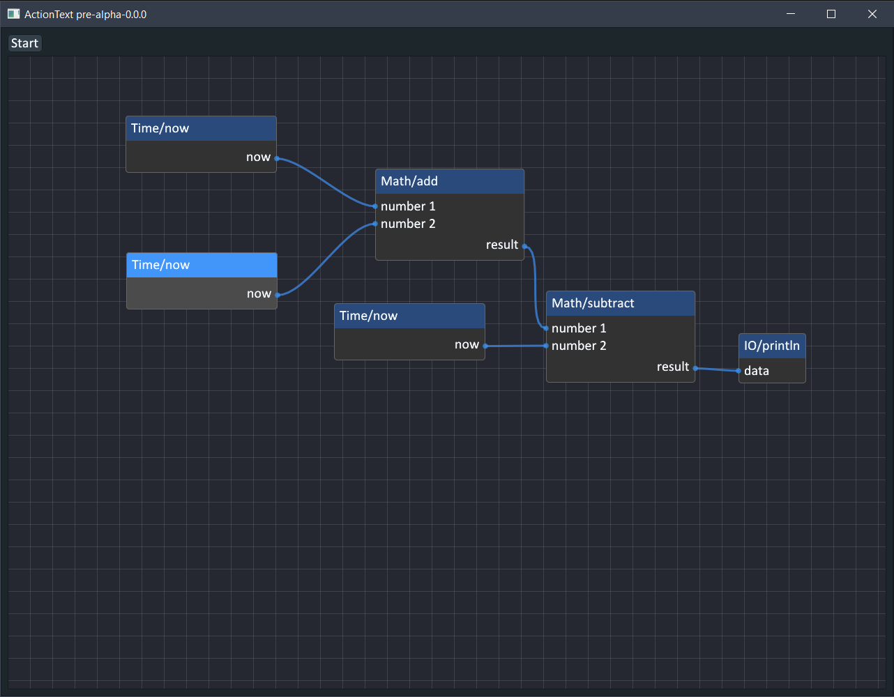

# ActionText

**ActionText is an experiment** in its early stage of infancy. It's a visual node-based programming proof of concept that I built for myself and intend to continue developing it. It's open source and will continue to be
as such for the foreseeable future.



The project will serve a number of purposes:

- Exploration into visual language design
- How much can we use Goroutines for flow control
- Can we build systems that are inherently concurrent regardless of the problem domain
- Can said system be done in 500LOC or less
- How would flow based programming look like in a CSP concurrency model
- Finally, can we get away with little to no graph theory

The thing works in its own limited way and the implementation is less than 350 LOC. That is the bare minimum required to get the backend and the frontend working without much of graph theory and entirely dependent on Goroutines for flow control. Programs produced using ActionText are concurrent by design.

I am however, still not happy with how the Goroutines are being used for flow control. So I will be pushing more into that direction.

As of now, the code all resides in a single file [main.go](main.go) and I will keep it as such until I cover all the happy paths. Expect bugs and expect a lot of corners being cut.

## How I built it

A more technical document will follow soon, for the time being here's a 10,000ft. view

### UI

The project depends on ImGUI for the UI using the brilliant Go binding by [AllenDang/giu](https://github.com/AllenDang/giu/) and his ImGUI repo [AllenDang/imgui-go](https://github.com/AllenDang/imgui-go/) which to my fortune ships with a binding for [Nelarius/imnodes](https://github.com/Nelarius/imnodes). Imnodes is one of the many node editor widgets available for ImGUI and probably in my opinion the easiest to use.

Though I'm in no way utilitzing the full extent of what giu can do, in fact I feel I'm doing it a diservice I do feel I will need to implement my own binding for Nelarius/imnodes to get access to more of the library's API surface area that isn't already exposed by AllenDang's imgui-go fork.

So far, the way the internal data design is a direct result of using Imnodes and the way ImGUI in general works. I'm not sure I'm too happy about that however for a PoC I don't really care. I am however trying to avoid the trap of saying I'll just implement a node editor widget from scratch.

I've taken liberal inspiration from [McManning/BlueGraph Unity Framework](https://github.com/McManning/BlueGraph), Unreal Engine Blueprints and [Pyno](https://github.com/honix/Pyno). In fact, I will be adding the ability to define custom code nodes the way Pyno allows you to do.


### Reactive by design

In a nutshell, every node in the graph is a Goroutine that's perpetually processing its inputs, executing its logic and broadcasting its outputs.

Each node is smart enough about when to execute its logic, specifically, each node will wait before further processing until all its
inputs are satisified. 
Node inputs are channels and each node can only carry a single output forward, the output of a node is the result of it's logic execution, this resulting value is broadcasted to any number of input channels linked to the output port of a node.

The system supports a single node outputing to any number of nodes, with the idea of each input being a channel that is writen to 
when a node wants to output a value, natural backpressure in the graph is formed and resolved on its own.

The effects of that are: 

- Nodes process only when all their inputs are satisifed (Node inputs can be satisifed either through default port values, values set in the UI or through linkage)
- Nodes broadcast only when they've processed
- Nodes will wait before processing the next cycle until their previous cycle's output are consumed

### Running

```shell
go mod tidy
go run main.go
```

Should get you up and running, right click the canvas to add a node. If it didn't work, either fix it and open a PR or file an issue.